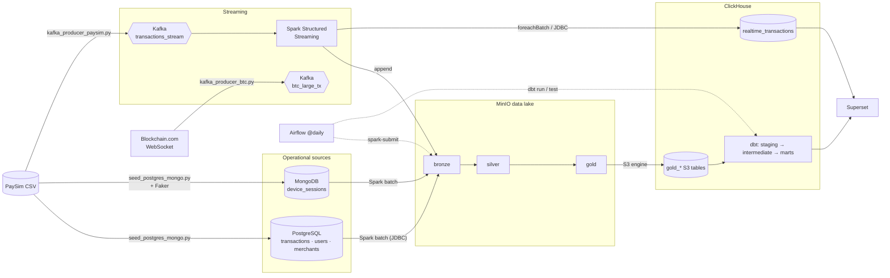

# Real-Time Fraud & Transaction Risk Monitoring Pipeline

A streaming and batch data platform for payment fraud monitoring. It runs end
to end on a local Docker stack: Kafka → Spark Structured Streaming → a MinIO
data lake (bronze / silver / gold) → ClickHouse → dbt → Superset. Airflow
manages the schedule.

It replays the [PaySim](https://www.kaggle.com/datasets/ealaxi/paysim1) mobile
money dataset as a live event stream. The dataset has 6.36 million
transactions over 743 simulated hours, and 8,213 of them are fraud (a 0.13%
fraud rate). A nightly batch job rebuilds the analytical layers that feed the
dashboard.

## What it does

- **Real-time path**: a Kafka producer replays PaySim in `step` order (1 step
  equals 1 simulated hour, compressed into a few seconds). Spark Structured
  Streaming writes every event to the bronze layer. In the same micro-batch,
  it also writes to a ClickHouse table that the dashboard reads live.
- **Batch path**: a daily Airflow DAG runs a PySpark job. It pulls
  transactions, users, and merchants from PostgreSQL, plus device sessions
  from MongoDB. Then it moves the data through bronze → silver (cleaned,
  deduplicated, enriched) → gold (aggregated) in MinIO.
- **Modeling**: ClickHouse reads the gold Parquet files directly through its
  `S3` table engine. dbt builds staging → intermediate → marts on top of
  that, checked by 14 data tests.
- **Serving**: Superset dashboards show the daily fraud rate, the riskiest
  merchants, and a velocity-based user alert feed.

## Architecture



The Bitcoin producer is optional. It is a live (not simulated) feed of large
transactions. It publishes to its own Kafka topic, but nothing downstream
reads from it yet.

## Stack

| Layer | Technology |
|---|---|
| Sources | PostgreSQL 16, MongoDB 7 |
| Streaming | Kafka 7.6 (Confluent) + ZooKeeper |
| Processing | Apache Spark 3.5 (Structured Streaming + batch PySpark) |
| Data lake | MinIO (S3-compatible), Parquet |
| Warehouse | ClickHouse 24.3 |
| Transformation | dbt (`dbt-clickhouse` 1.7) |
| Orchestration | Apache Airflow 2.9 |
| BI | Apache Superset |

## Data model

| Model | Grain | Purpose |
|---|---|---|
| `fct_fraud_rate_daily` | day | Transaction count, fraud count and fraud rate per simulated day |
| `dim_high_risk_merchants` | merchant | Leaderboard ranked by fraud ratio |
| `fct_user_risk_alerts` | user × step | Users with an unusual number of transactions in one hour (velocity rule) |

Staging models read the gold-layer S3 tables. The `int_user_velocity_risk`
model holds the velocity rule. Tests check uniqueness and not-null keys on
every mart, plus accepted values on the alert flag.

## Dashboard

<!-- Drop a screenshot at docs/dashboard.png, then uncomment:

-->

## Running it

Requirements: Docker Desktop with **at least 8 GB of RAM** allocated (the
stack runs 12 containers), Python 3.10 or newer, and the PaySim CSV file from
Kaggle.

```bash
cp .env.example .env
```

Replace every `change_me` value in `.env`. Create a virtualenv and run
`pip install -r requirements.txt` (the seed script and producers run on the
host). Then start the stack:

```bash
docker compose up -d --build
```

Put the dataset at `data/paysim.csv`. Then create the MinIO bucket and Kafka
topics, seed the sources, and start the streaming job and producer. Every
command for these steps is in **[WALKTHROUGH.md](WALKTHROUGH.md)**, a
detailed runbook written in Indonesian for Windows and PowerShell.

| Service | URL | Login |
|---|---|---|
| Airflow | http://localhost:8081 | `admin` / `AIRFLOW_ADMIN_PASSWORD` |
| Superset | http://localhost:8088 | `admin` / `SUPERSET_ADMIN_PASSWORD` |
| MinIO console | http://localhost:9001 | `minio_admin` / `MINIO_ROOT_PASSWORD` |
| Spark master UI | http://localhost:8080 | — |
| ClickHouse HTTP | http://localhost:8123 | `default` / `CLICKHOUSE_PASSWORD` |

All credentials live in `.env`, which is git-ignored. `docker-compose.yml`,
the Spark jobs, the dbt profile, and the seed script all read their values
from this file.

## Engineering notes

Things that didn't work the first time, and why the code looks the way it
does:

- **Bitnami's Spark images went paid.** `bitnami/spark` stopped being freely
  available in mid-2025, so the stack uses the official `apache/spark` image
  and starts master and worker explicitly through `spark-class`.
- **MinIO disappeared from Docker Hub.** `minio/minio` and `minio/mc` can no
  longer be pulled from Docker Hub. The stack still worked on my machine
  only because the images were already cached. A fresh clone would fail at
  `docker compose up`. Both images now come from `quay.io`, MinIO's own
  registry, pinned to release tags with the same digests as the images I was
  running. Superset is pinned to `6.1.0` instead of `:latest` for the same
  reason.
- **A small seed sample had exactly one day in it.** PaySim packs thousands
  of transactions into each hourly step. The first 20,000 rows covered less
  than one simulated day, so the daily fraud-rate chart was just a single
  point. The seed now defaults to 1.5 million rows (about five days). You
  can change this with the `SEED_ROWS` variable.
- **The velocity rule never fired.** A classic fraud rule flags users with
  three or more transactions in one hour. But PaySim's origin account IDs
  are almost unique per transaction, and the seeded sample never goes above
  two transactions per user per step. The threshold is set to 2 so the
  alert feed has something to show. This is a limit of the dataset, not a
  real finding. In this data, the velocity rule demonstrates the mechanism,
  not actual fraud detection.
- **The fraud-rate spike is a volume dip, not an attack.** In the seeded
  sample, the daily fraud rate jumps from 0.05% to 4.5% on day 2. But the
  fraud *count* barely moves, staying between 216 and 306 per day.
  Legitimate transaction volume drops from 571,000 to 6,700 that day.
  PaySim injects fraud at a roughly steady rate, so the rate chart mostly
  tracks the denominator, not the fraud itself. This is why the dashboard
  should show the fraud count next to the rate.
- **One NULL bucket topped the merchant leaderboard.** Only 500 merchants
  are seeded, so most destination accounts have no merchant name. Superset
  groups every NULL value into a single "N/A" row. A couple of fraud cases
  in that row gave it a 100% fraud ratio, higher than any real merchant.
  Unmatched merchants are now excluded in `dim_high_risk_merchants`.
- **Restarting the stack broke the streaming job.** Kafka has no volume
  here, so topic offsets reset to zero on every restart. But the Spark
  checkpoint in MinIO still remembers the old, higher offsets. Setting
  `failOnDataLoss=false` lets the job continue with a warning instead of
  crashing every time the stack restarts.
- **Init scripts can't read `.env`.** ClickHouse's S3 tables need the MinIO
  password, but `.sql` files in `docker-entrypoint-initdb.d` don't get
  variable substitution. So the ClickHouse init script is written in shell
  instead of SQL. `.gitattributes` forces LF line endings on `*.sh` files,
  so a Windows checkout can't break the script with CRLF.
- **On a fresh clone, ClickHouse crashed on startup.** The gold S3 tables
  were declared without columns, so ClickHouse tried to guess the schema by
  reading the Parquet files at `CREATE TABLE` time. On the first
  `docker compose up`, the batch job hasn't run yet and the bucket doesn't
  even exist. So the init script failed with `NoSuchBucket` and the
  container exited. The columns are now written out explicitly, and the
  tables create fine even against an empty lake. They have to stay
  `Nullable`. Spark writes optional Parquet columns, and a plain `String`
  type turns every NULL `merchant_name` into an empty string `''`. The
  `is not null` filter in `dim_high_risk_merchants` would then let through
  639,406 rows instead of 500. That brings back the NULL-bucket problem
  above, and every test still passes without catching it.

## Repository layout

```
airflow/            Custom Airflow image (docker CLI + dbt) and the DAG
clickhouse_init/    ClickHouse tables: real-time sink + S3 tables over gold
dbt_project/        dbt models (staging / intermediate / marts) and tests
ingestion/          Seed script and Kafka producers (run from the host)
postgres_init/      Source schema for PostgreSQL
spark_jobs/         Structured Streaming job and batch medallion job
docker-compose.yml  The whole stack
```

## Data and license

PaySim is a synthetic dataset created by E. A. Lopez-Rojas, published on
[Kaggle](https://www.kaggle.com/datasets/ealaxi/paysim1). It is not included
in this repository. Download it separately and check its license there.

The code in this repository is released under the [MIT License](LICENSE).
